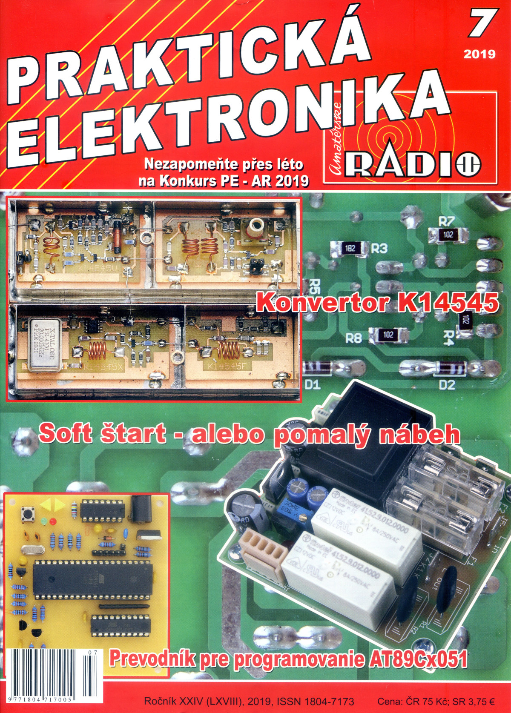
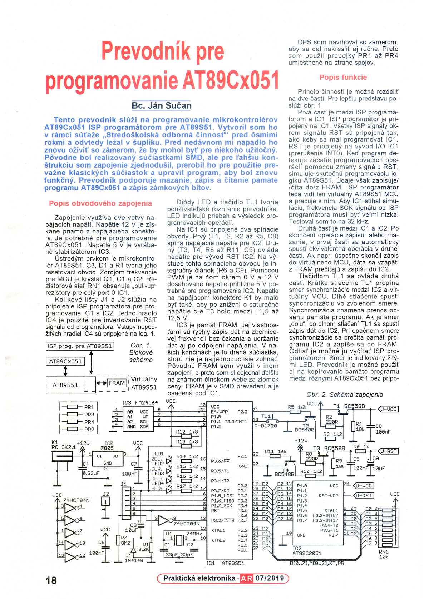
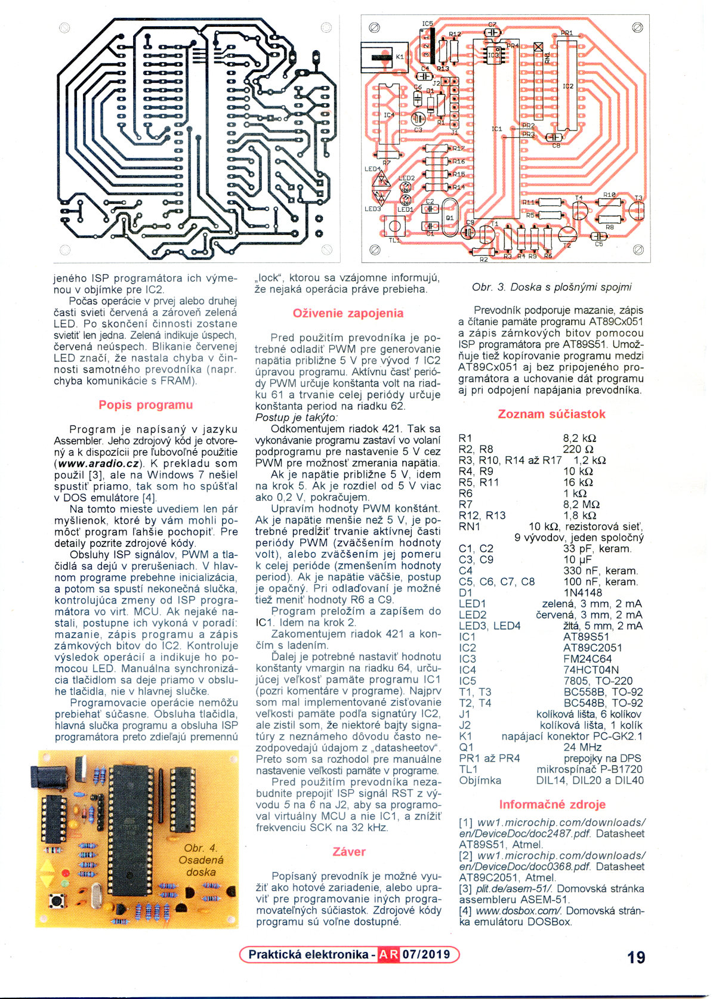

***

**This is a frozen project. It is intended to provide authentic snapshot of the
history with all the good things and all the things that could be improved.**

***

# Converter for AT89Cx051 programming

The article was published in July 2019 in Czech magazine [Praktická
elektronika - Amatérské Radio](http://aradio.cz). It is written in Slovak
language.

It describes construction of converter for programming AT89Cx051
microcontrollers using an ISP programmer for AT89S51. I created this device for
attending a contest at a secondary technical school where I studied. It had been
stashed in a drawer since then until I decided to revive it. It was originally
realized with SMD parts but for easier construction I modified it for use of
mainly classic electronic parts. It supports erasing, writing, and reading of
the program memory of AT89Cx051 and writing its lock bits.

Its purpose is the same as [my previous
construction](https://github.com/jansucan/aradio-atcisp) has, but it uses a
different principle.

The functionality can be split into two parts. The first part is between an ISP
programmer and the onboard AT89S51 MCU. The programmer is connected to the MCU
and the RST programming signal is used as an external interrupt source. When the
firmware detects start of a programming operation using the interrupt, it
simulates the real programming logic of AT89S51. However, the data is
written/read to/from the FRAM memory connected to the MCU. The ISP programmer
sees only a virtual AT89S51 MCU. In order for the real AT89S51 to be able to
process the ISP programming signals in real-time the frequency of the SCK clock
has to be fairly low. I tested it with 32 kHz.

The second part is between AT89S51 and AT89Cx051. After a programming operation
in the first part is completed, an equivalent operation is executed in the
second part. For example, if write operation to the virtual AT89S51 is
completed, the data is read from the FRAM and written to the AT89Cx051.

The button controls the second part. Short press switches a direction of
synchronization (up or down) between AT89Cx051 and the virtual MCU. Long press
starts a synchronization in the selected direction. The synchronization means
transfer of a data for AT89Cx051. If the direction is down, the long press
starts write of data from the FRAM to the AT89Cx051. It the direction is up data
are read from AT89Cx051 and written to the FRAM. From there it can be read by
the ISP programmer. The direction of synchronization is indicated by the yellow
LEDs.

This converted can be also used for copying program memory of AT89Cx051 without
any ISP programmer connected using only programming operations in the second
part.

During an ongoing operation in the first or the second part the red and the
green LED are both on. After the operation is finished, only one of the two LEDs
is on. The green LED indicates success, the red one indicates an error.

